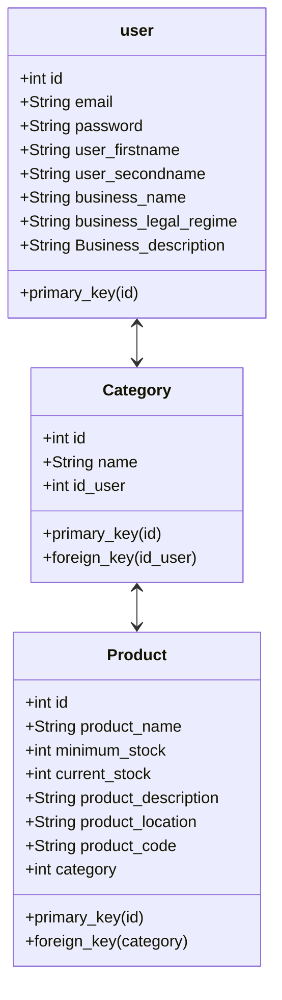

# Architecture Overview

## Docker

>How I used Docker in this project:

Each service represent a ***container in execution***. ***PhpMyAdmin***, ***www*** and ***MySQL*** are the services showed inside the ***Docker Host***. PhpMyAdmin is the only service that can be accessed from outside the Docker Host. All services, ***PhpMyAdmin***, ***www*** and ***MySQL*** are bounded by a ***link***. The images that were created to stablish the services PhpMyAdmin and MySQL are located inside of each ***container***.The service of ***MySQL*** use a ***volume*** to store all data bases, as the ***www*** use a volume to store CE content.

## SQL Database

> ***CE Database***: Entity relationship diagram

In this schema, ***user*** table stores information about the app user and the business that he/she runs. Each user creates new categories, which are stored in ***category*** table, and each category has products, which are stored in ***product*** table.
