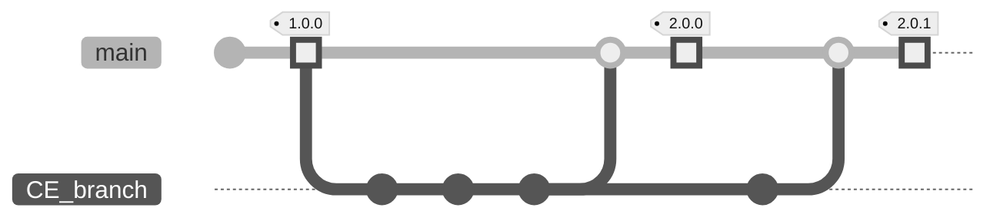

# Controle de estoque

>**Stock Control:**
>A stock control app developed using php with mysql and built using docker.

## Installation

This app is built in **[Docker](https://www.docker.com/products/docker-desktop/)**, make sure you have this installed before run it.

Clone `main` branch from my **[repo](https://github.com/joaobotelho072002/joaobotelho072002.github.io)**.

## Usage

Access `projects/controle_de_estoque` folder:

```bash
cd projects/controle_de_estoque
```

How to run the app:

```bash
# builds the images and the containers
docker compose build
```

```bash
# runs the containers,creates the local network and the volume
docker compose up
```

Acess your web browser and enter the following link ***`http://localhost:8001/`***.

## Git Development Steps

How I organized myself during the development of this app.



In which CE was include in the [release ***2.0.0***](https://github.com/joaobotelho072002/joaobotelho072002.github.io/releases/tag/2.0.0) and this documentation on [release ***2.0.1***](https://github.com/joaobotelho072002/joaobotelho072002.github.io/releases/tag/2.0.1)

## Contributing

Pull requests are welcome. For major changes, please open an issue first to discuss what you would like to change.

Please make sure to update tests as appropriate.
