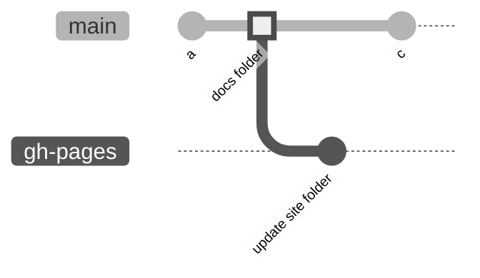

---
hide:
  - navigation
---
# Documentation Overview

---

> How I built and deployed this documentation

## Idealization

To create this documentation I used [***mkdocs***](https://www.mkdocs.org/), a static site generator which uses Markdown format to write the files and it is built using a single yaml configuration file, with [***mkdocs-material***](https://squidfunk.github.io/mkdocs-material/) customized theme. Mkdocs requires a recent version of python, I used [***python3.7***](https://www.python.org/downloads/).

## Local development

Folder structure:

```bash
documentation
│   ...
│   ...   
│
└───docs # main folder
│   │   README.md
│   │   requirements.txt # requirements
│   │   mkdocs.yml # configuration file
│   │   
│   └───docs # configuration file points to this folder
│       │   {documentation files} # folders and Markdown files
```

I created and activated a new python virtual environment.

```bash title="Create and activate a python virtual environment"
python3 -m venv <venv_name>
source <venv_name>/bin/activate
```

Used the package manager [***pip***](https://pip.pypa.io/en/stable/) to install requirements.

```bash title="Install the requirements"
cd documentation/docs/
pip install -r requirements.txt
```

To build documentation and host it locally, I used both of this commands:

```bash title="Run mkdocs locally"
# builds the documentation
mkdocs build
# hosts it locally
mkdocs serve 
```

## Documentation deploy

To build the documentation, mkdocs creates a new folder ***`site/`*** which contains all the HTML, CSS and JS files that are created with the ***`build`*** command. To deploy this documentation in git, I created a new [***`github pages`***](https://pages.github.com/) instance, which points to ***`gh-pages`*** git branch. This git branch contains the ***`site/`*** files.



After the commit in the ***`docs/`*** main folder, a Github Actions workflow is triggered in which:

  1. Requirements are installed;
  2. Command ***`mkdocs gh-deploy`*** runs and updates the ***`gh-pages`*** branch with the ***`site/`*** folder.

```yaml title="pages-deploy.yml"
name: build and deploy - mkdocs
on:
  push:
    branches:
      - main
    paths:
      - 'docs/**'
jobs:
  deploy:
    runs-on: ubuntu-latest
    steps:
      - uses: actions/checkout@v2
      - uses: actions/setup-python@v2
        with:
          python-version: 3.x
      - run: |
          cd docs
          pip install -r requirements.txt
          mkdocs gh-deploy --force --clean --verbose
```

Afterwards, the documentation site [***https://joaohb07.github.io/documentation***](https://joaohb07.github.io/documentation) is updated by `gh-pages` branch.

## Contributing

Pull requests are welcome. For major changes, please open an issue first to discuss what you would like to change.

Please make sure to update tests as appropriate.
